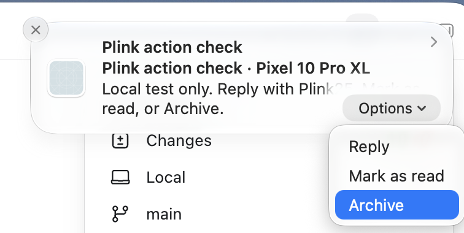
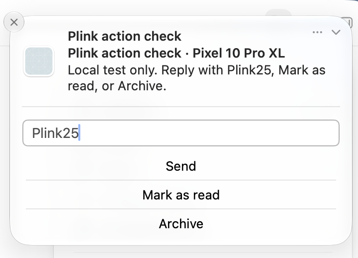

# Checkpoint 25: Live native notification actions and Reply

The reviewed checkpoint `fc0030c` was installed over the existing Mac and Pixel
apps, preserving pairing and app data. Mac build 5 and the Pixel's installed APK
were checked against the tested artifacts. Production source did not change.

A separate, temporary Android app posted a local notification through Plink's
real notification listener and paired transport. Its three buttons appeared in
the native Mac notification menu. The user explicitly confirmed performing each
action on the Mac; the Android receiver recorded these results:

| Native Mac action | Android result |
| --- | --- |
| Mark as read | One read callback; no reply or archive callbacks |
| Reply with `Plink25` | One reply; exact text in the one intended RemoteInput key; no other callbacks |
| Archive | One archive callback; no reply or read callbacks |

Each trial used a fresh, explicit fixture generation. Results were collected
before stopping the old generation. There was no automatic repost, direct
receiver invocation, real message, or action against a personal notification.

Screenshots were supplied by the user. Computer use continued to fail with
`native pipe closed before response`; it did not perform these interactions.
The screenshots show native presentation, user confirmation establishes the
interaction's origin, and independent receiver counts establish execution.

This proves the local fixture's actions through the real paired devices. It does
not establish every messaging provider's behavior or recipient delivery. Live
Unicode, stale-action interaction, and hardware/profile-lock checks remain
separate from the simulated coverage. The blank primary notification icon and
cellular audio remain unresolved.

The user then confirmed that a real message sent from their own OnePlus/Google
Voice to the Pixel could be replied to from Mac Notification Center, with the
reply arriving on the OnePlus. This is user-reported verification of that one
provider flow, separate from the instrumented fixture. The assistant sent no
message and did not inspect the provider's receipt or message body. The user
also reported that calls display correctly but audio still falls back to the
phone.

Checkpoint 24's unchanged production source passed 565 automated tests and 19
Android framework scenarios. That baseline is identified separately in
`verification.json`; these three live trials are additional evidence, not a
repeat of that automated gate.

The required post-live `./scripts/verify.sh` also passed all 565 tests, lint,
builds and packaging. Its rebuilt artifact hashes are recorded separately from
the installed artifacts used for the live trials. No additional reinstall was
performed for this gate.

The test notification was canceled and its app uninstalled. The temporary
fixture builds, signing key, source working directory, and Mac installer backup
were removed. Phone settings, pairing, and production app data were preserved.
The intended updated apps remain installed. The reviewed fixture's source-only
archive and hashes are retained for reproducibility, without keys or binaries.
